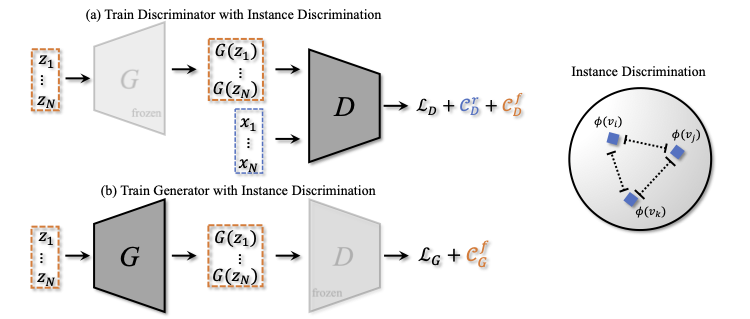

# InsGen - Data-Efficient Instance Generation from Instance Discrimination


**Figure:** *Training framework of InsGen.*

> **Data-Efficient Instance Generation from Instance Discrimination** <br>
> Ceyuan Yang, Yujun Shen, Yinghao Xu, Bolei Zhou <br>
> *ArXiv link*

[Paper]
[[Project Page](https://genforce.github.io/InsGen/)]

In this work, we develop a novel data-efficient Instance Generation (**InsGen**) method for training GANs with limited data. With the instance discrimination as an auxiliary task, our method makes the best use of both real and fake images to train the discriminator. In turn the discriminator is exploited to train the generator to synthesize as many diverse images as possible. Experiments under different data regimes show that InsGen brings a substantial improvement over the baseline in terms of both image quality and image diversity, and outperforms previous data augmentation algorithms by a large margin. 


## BibTeX

```bibtex
@inproceedings{yang2021insgen,
  title     = {Data-Efficient Instance Generation from Instance Discrimination},
  author    = {Yang, Ceyuan and Shen, Yujun and Xu, Yinghao and Zhou, Bolei},
  booktitle = {Arxiv link},
  year      = {2021}
}
```
