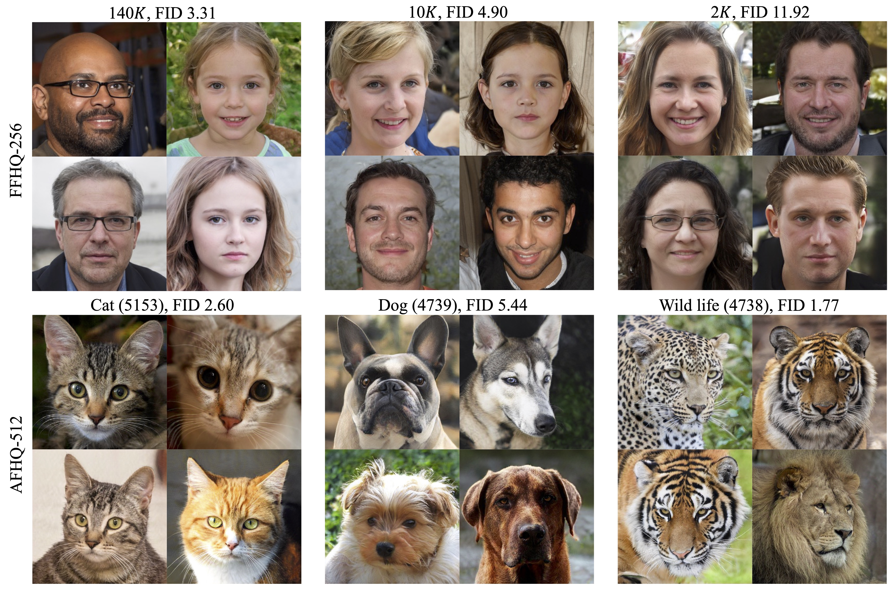

# InsGen - Data-Efficient Instance Generation from Instance Discrimination


> **Data-Efficient Instance Generation from Instance Discrimination** <br>
> Ceyuan Yang, Yujun Shen, Yinghao Xu, Bolei Zhou <br>
> *arXiv preprint arXiv: 2106.04566*

[[Paper](https://arxiv.org/pdf/2106.04566.pdf)]
[[Project Page](https://genforce.github.io/insgen/)]

In this work, we develop a novel data-efficient Instance Generation (**InsGen**) method for training GANs with limited data. With the instance discrimination as an auxiliary task, our method makes the best use of both real and fake images to train the discriminator. The discriminator in turn guides the generator to synthesize as many diverse images as possible. Experiments under different data regimes show that InsGen brings a substantial improvement over the baseline in terms of both image quality and image diversity, and outperforms previous data augmentation algorithms by a large margin.

## Qualitative results

Here we provide some synthesized samples with different numbers of training images and correspoding FID. Full codebase and weights are coming soon.


## Inference

Here, all pretrained models can be downloaded from [Google Drive](https://drive.google.com/drive/folders/1FhRr3oi1pZLySiI8ZEDkXKKcrg2KIuQs?usp=sharing):

| Model | FID | Link |
| :--- | :------: | :--------: |
| AFHQ512-CAT    | 2.60     | [link](https://drive.google.com/file/d/1odKZv7HZunIaWZp8jVi203xYzzroJk2F/view?usp=sharing) |
| AFHQ512-DOG    | 5.44     | [link](https://drive.google.com/file/d/1KFFFRvHI7EmOxSIsB5Mi82QdUZUVmEl6/view?usp=sharing) |
| AFHQ512-WILD   | 1.77     | [link](https://drive.google.com/file/d/18SdOMyNIM6SAprkh2W-lliPGVcSWI_Jc/view?usp=sharing) |

| Model | FID | Link |
| :--- | :------: | :--------: |
| FFHQ256-2K     | 11.92    | [link](https://drive.google.com/file/d/1_zshxmA_R3mOVIoOhgBa1ZPQx1gY_BDX/view?usp=sharing) |
| FFHQ256-10K    | 4.90     | [link](https://drive.google.com/file/d/1VfxJd7hy_A_hrUf5piZg_NvH-RTbWqyB/view?usp=sharing) |
| FFHQ256-140K   | 3.31     | [link](https://drive.google.com/file/d/10tSwESM_8S60EtiSddR16-gzo6QW7YBM/view?usp=sharing) |

You can download one of them and put it under `MODEL_ZOO` directory, then synthesize images via

```bash
# Generate AFHQ512-CAT with truncation.
python generate.py --network=${MODEL_ZOO}/afhqcat.pkl \
                   --outdir=${TARGET_DIR} \
                   --trunc=0.7 \
                   --seeds=0-10
```

## Training

This repository is built based on [styleGAN2-ada-pytorch](https://github.com/NVlabs/stylegan2-ada-pytorch). Therefore, please prepare datasets first use `dataset_tool.py`. On top of Generative Adversarial Networks (GANs), we introduce contrastive loss into the training of discriminator, following [MoCo](https://github.com/facebookresearch/moco). Concretely, the discriminator is used to extract features from images (either real or synthesized) and then trained with an auxiliary task by distinguishing *every* individual image.

As described in `training/contrastive_head.py`, we add two addition heads on top of the original discriminator. These two heads are used to project features extracted from real and fake data onto a unit ball respectively. More details can be found in [paper](https://arxiv.org/pdf/2106.04566.pdf). **Note that InsGen can be easily applied to any GAN model by merely introducing two contrastive heads.** According to [MoCo](https://github.com/facebookresearch/moco), the feature extractor should be updated in a momentum manner. Here, in InsGen, the contrastive heads are updated in the `forward()` function, while the discriminator is updated in `training/training_loop.py` (see `D_ema`).

Please use the following command to start your own training:

```bash
python train.py --gpus=8 \
                --data=${DATA_PATH} \
                --cfg=paper256 \
                --outdir=training_example
```

In this example, the results are saved to a created director `training_example`. `--cfg` specifies the training configuration, which can be further customized with additional options:

- `--no_insgen` disables InsGen, back to original StyleGAN2-ADA.
- `--rqs` overrides the number of real image queue size. (default: 5% of the total number of training samples)
- `--fqs` overrides the number of fake image queue size. More samples are beneficial, especially when the training samples are limited. (default: 5% of the total number of training samples)
- `--gamma` overrides the R1 gamma (*i.e.*, gradient penalty). As described in [styleGAN2-ada-pytorch](https://github.com/NVlabs/stylegan2-ada-pytorch), training can be sensitive to this hyper-parameter. It would be better to try some different values. Here, we recommend using a smaller one than that in original StyleGAN2-ADA.

More functions would be supported after this projest is merged into our [genforce](https://github.com/genforce/genforce). Please stay tuned!

## License

This work is made available under the [Nvidia Source Code License](https://nvlabs.github.io/stylegan2-ada-pytorch/license.html).

## Acknowledgements

We thank Janne Hellsten and Tero Karras for the pytorch version codebase of their [styleGAN2-ada-pytorch](https://github.com/NVlabs/stylegan2-ada-pytorch).

## BibTeX

```bibtex
@article{yang2021insgen,
  title   = {Data-Efficient Instance Generation from Instance Discrimination},
  author  = {Yang, Ceyuan and Shen, Yujun and Xu, Yinghao and Zhou, Bolei},
  journal = {arXiv preprint arXiv:2106.04566},
  year    = {2021}
}
```
